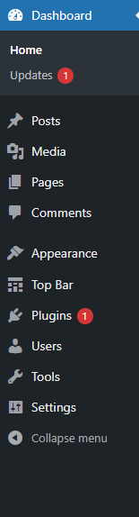
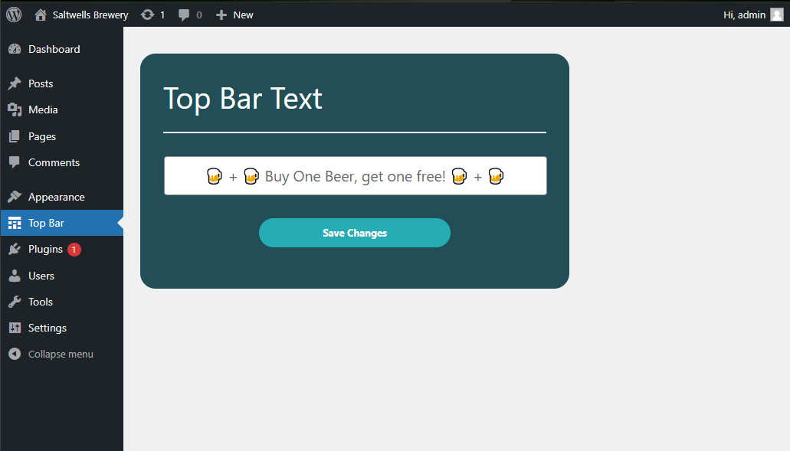
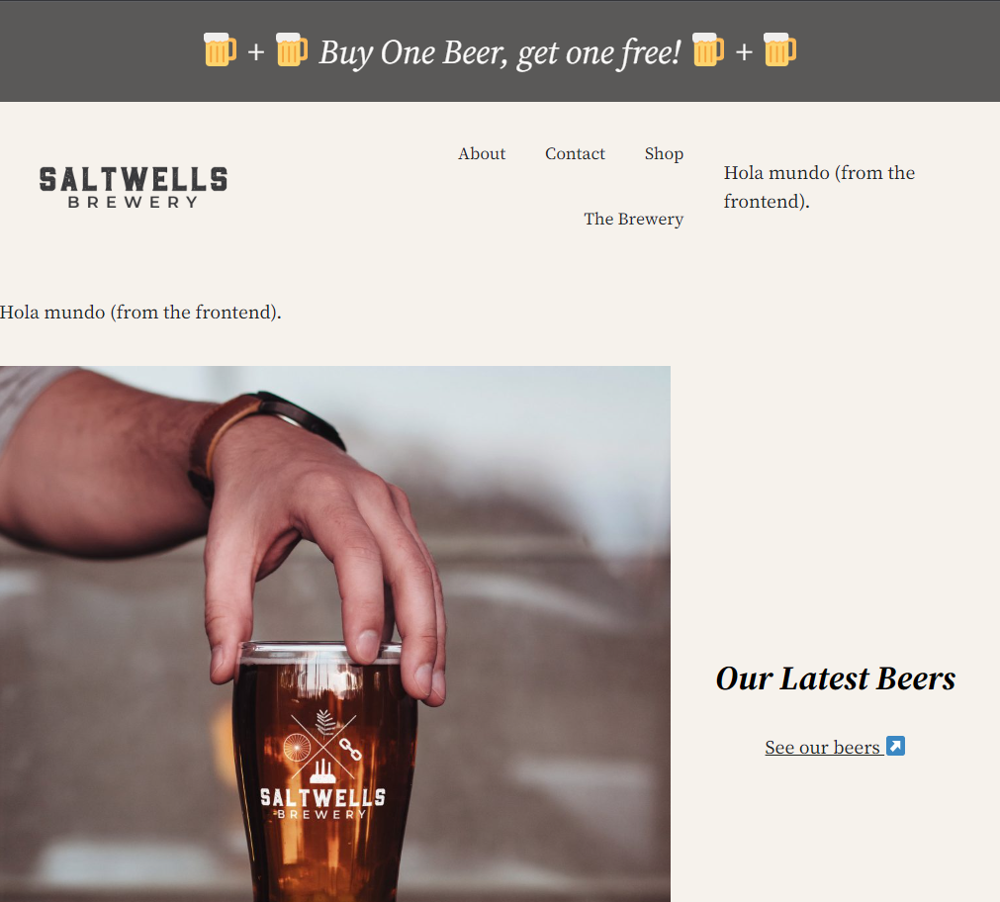

# Creating the plugin
## Set up a new folder

The first step is to create a folder in the plugins folder: 

**mytheme / wordpress / wp-content / plugins**

Create the folder with the plugin name, e.g. topbar.


Open the folder in VSCode. 

Now, create a file called with the plugin name, e.g. 'topbar.php'

This should now be visible in the plugins section of your WordPress installation.

# Configure the plugin


Every WordPress plugin must have a description with the plugin name as a minimum. 

```
/**
 * Plugin Name:       Welcome Top Bar
 * Plugin URI:        https://myawesomeplugin.com
 * Description:       Displays a welcome bar at the top of your page. 
 * Version:           1.0.0
 * Author:            Benjamin Bagley
 * Author URI:        https://benbagleydesign.com
 **/

```


How this looks in the plugins directory:


# Coding the plugin

The plugin will create a welcome message that appears above the top navigation bar. The message will display *'Welcome to (sitename)'* when a user is not logged in, else it will display *'Welcome (user)'* when a user is logged in. 

## Step One

### Add the code so it appears after the `<body>` tag

To make the code display after the `<body>` tag,  call the WordPress function  `wp_body_open` with the WordPress `add_action` hook. We also create here our own function,  `tb_head`. 

```
 //Add bar after the opening body tag

 add_action('wp_body_open', 'tb_head');
 
```

## Step Two
### Create the function to determine if a user is logged in, or not

Create a function called `get_user_or_websitename`. This function determines, using the WordPress function `is_user_logged_in()`, if the user is logged in, or not. If a user is not logged in, then it returns the blog name using the WordPress function `get_bloginfo('name')`. 

If a user is logged in, then it returns the current users name. This is done with the variable `$current_user,` which holds the value of the WordPress function `wp_get_current_user()`. In the return statement there is an object operator `->` which accesses the property `user_login` of `wp_get_current_user()`

```
function get_user_or_websitename()
{
    if( !is_user_logged_in()  ) // if user is not logged in
    {
        return 'to ' . get_bloginfo('name'); // returns the blog name
    }
    else 
    {
        $current_user = wp_get_current_user();
        return $current_user -> user_login; // returns username
    }
}

```

## Step Three 
### Call the function to determine user login status 

The `tb_head()` function creates the welcome message in `<h3>` tags, remembering to concatanate with periods. The function created previously, `get_user_or_websitename()` is called here to be displayed alongside the welcome message. 

```
// calls the function to determine if user is logged or not

 function tb_head()
 {
    echo '<h3 class="tb">Welcome ' . get_user_or_websitename() . '</h3>'; 

 }


```

## Step Four 
### Apply some styling 

The final step applies inline styling to the welcome message with the creation of a new function, `tb_css`. This appears in the `<style>` tags in the `<head>` of the page and calls the WordPress function `wp_print_styles` using the `add_action` hook. 

```
add_action('wp_print_styles', 'tb_css');

function tb_css()
{
    echo '
        <style>
        h3.tb {color: #fff; margin: 0px; padding: 30px; text-align:center; background:#FCC263;}
        </style>
    ';
}

```

# The result 
## When a user is not logged in


## When a user is logged in


# Adding A Custom Backend Field

The following allows a custom message to appear upon the website (whenever a user is not logged in). 

## Step Five: Create a function for the backend page

Underneath the frontend code, still within the **topbar.php** plugin, we need to define a new function, this one is called: `function topbar_backend_page()`. This will tell WordPress to create a new dashboard icon that will lead to our plugin page. 

```

// Top Bar backend page

function topbar_backend_page() {
    $page_title = 'Top Bar Options';
    $menu_title = 'Top Bar';
    $capability = 'manage_options'; // controlling access to the page
    $slug = 'topbar-plugin'; // something unique
    $callback = 'topbar_page_html'; // the function that renders the page
    $icon = 'dashicons-schedule';
    $position = 60; // position on dashboard

    add_menu_page($page_title, $menu_title, $capability, $slug, $callback, $icon, $position);
}

// hook to call function

add_action('admin_menu', 'topbar_backend_page');

```

The function defines WordPress variables with our plugin requirements, and then calls on the WordPress function `add_menu_page`, to add the menu to the page. 

The `add_action` WordPress hook is then called with the WordPress `admin_menu` function and `topbar_backend_page` function that we just created.

The result is as follows:



## Step Six: Create the field function

Next, we create a function called `topbar_register_settings()`. In the function parameters we use the WordPress `register_settings` hook,  which defines a WordPress `$option_group`, and a name for the field. In this instance we name them `topbar_option_group` and `topbar_field` respectively. 

```
// function for adding a field 

function topbar_register_settings() {
    register_setting('topbar_option_group', 'topbar_field'); // first parameter is the group
    register_setting( $option_group:string, $option_name:string, $args:array )
}
```


## Step Seven: Render the HTML page 
Now we are going to create the HTML page so that the field for inputting our custom message is created.

First we create the function `topbar_page_html()`

Making sure to first close the php `?>` we define the HTML form as follows:

```

// rendering the html page topbar_page_html
// closing off the php 
function topbar_page_html() { ?> 
<!-- Class of wrap comes with WordPress -->

<div class="wrap top-bar-wrapper">
    <form method="post" action="options.php">
        <?php settings_errors();  // adds an error if there is an issue ?> 
        <?php settings_fields('topbar_option_group'); // adding the group option ?>
        <label for="topbar_field_id">Top Bar Text <br> <hr></label>
        <input name="topbar_field" id="topbar_field_id" type="text" value=" 
        <?php echo get_option('topbar_field'); // gets the input text from the field ?> 
        ">
        <div style="width:50%; margin:auto;"><?php submit_button(); ?></div>
    </form>

</div>


<?php }


```

We start off defining the form inside a WordPress wrapper. This is defined inside a HTML `div` element's class properties, alongside a custom class that can be used to style the form later on. 

The form is then created within a `<form>` tag, with a method set as `post` to send the form information to the server, and the action set as `options.php` to retrieve the parameters from the WordPress `options.php` file. 

Then inside the HTML form, some php is defined. 

First, there is a line that states if there is an error to show a message: ` settings_errors();` 

Then, the `topbar_option_group` that was defined earlier is called to define the group options. 

The next line of importance is the input HTML field, which injects a PHP statement that will take the value inputted into the text field and then output to the browser window, depending on the following: 
<ol>
<li> If a user is logged in, then it will display the user name and a welcome message.
<li> If a user is not logged in, then it will display the custom message.
<li> If no user is logged in, and there is no custom message, the default welcome message is displayed.
</ol>

To achive this, we have to place this line of php `<?php echo get_option('topbar_field')`  in the `value` parameter of the `input` element, which calls the `id` of the input `topbar_field`.

We now need to go to the if statement created in Step Two to alter it so that it recognises when a user has inputted text in the field. 

```

 
    if( !is_user_logged_in()  ) // if user is not logged in
    {   

        if(get_option('topbar_field')){ // if text field is used
            return get_option('topbar_field');
        } else {
            return 'Welcome to ' . get_bloginfo('name'); // returns the blog name    
        }
		
		
```

Going back to the form, insert a php submit button `<?php submit_button(); ?>` to allow the form to save the message changes. 

Finish by styling the form with reference to the `top-bar-wrapper` class. 


# Result
## Backend 





## Frontend




*(User not logged in)*


## Reference

This plugin was created with reference to this video: https://www.youtube.com/watch?v=SoIQdR_0SUc


