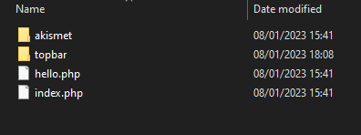

# Creating the plugin
## Set up a new folder

The first step is to create a folder in the plugins folder: 

**mytheme / wordpress / wp-content / plugins**

Create the folder with the plugin name, e.g. topbar.




Open the folder in VSCode. 

Now, create a file called with the plugin name, e.g. 'topbar.php'

This should now be visible in the plugins section of your WordPress installation.

# Configure the plugin


Every WordPress plugin must have a description with the plugin name as a minimum. 

```
/**
 * Plugin Name:       Welcome Top Bar
 * Plugin URI:        https://myawesomeplugin.com
 * Description:       Displays a welcome bar at the top of your page. 
 * Version:           1.0.0
 * Author:            Benjamin Bagley
 * Author URI:        https://benbagleydesign.com
 **/

```


How this looks in the plugins directory:


# Coding the plugin

The plugin will create a welcome message that appears above the top navigation bar. The message will display *'Welcome to (sitename)'* when a user is not logged in, else it will display *'Welcome (user)'* when a user is logged in. 

## Step One

### Add the code so it appears after the `<body>` tag

To make the code display after the `<body>` tag,  call the WordPress function  `wp_body_open` with the WordPress `add_action` hook. We also create here our own function,  `tb_head`. 

```
 //Add bar after the opening body tag

 add_action('wp_body_open', 'tb_head');
 
```

## Step Two
### Create the function to determine if a user is logged in, or not

Create a function called `get_user_or_websitename`. This function determines, using the WordPress function `is_user_logged_in()`, if the user is logged in, or not. If a user is not logged in, then it returns the blog name using the WordPress function `get_bloginfo('name')`. 

If a user is logged in, then it returns the current users name. This is done with the variable `$current_user,` which holds the value of the WordPress function `wp_get_current_user()`. In the return statement there is an object operator `->` which accesses the property `user_login` of `wp_get_current_user()`

```
function get_user_or_websitename()
{
    if( !is_user_logged_in()  ) // if user is not logged in
    {
        return 'to ' . get_bloginfo('name'); // returns the blog name
    }
    else 
    {
        $current_user = wp_get_current_user();
        return $current_user -> user_login; // returns username
    }
}

```

## Step Three 
### Call the function to determine user login status 

The `tb_head()` function creates the welcome message in `<h3>` tags, remembering to concatanate with periods. The function created previously, `get_user_or_websitename()` is called here to be displayed alongside the welcome message. 

```
// calls the function to determine if user is logged or not

 function tb_head()
 {
    echo '<h3 class="tb">Welcome ' . get_user_or_websitename() . '</h3>'; 

 }


```

## Step Four 
### Apply some styling 

The final step applies inline styling to the welcome message with the creation of a new function, `tb_css`. This appears in the `<style>` tags in the `<head>` of the page and calls the WordPress function `wp_print_styles` using the `add_action` hook. 

```
add_action('wp_print_styles', 'tb_css');

function tb_css()
{
    echo '
        <style>
        h3.tb {color: #fff; margin: 0px; padding: 30px; text-align:center; background:#FCC263;}
        </style>
    ';
}

```

# The result 
## When a user is not logged in


## When a user is logged in


# Adding A Custom Backend Field

The following allows a custom message to appear upon the website (whenever a user is not logged in). 

## Step One: Create a function for the backend page

Underneath the frontend code, still within the **topbar.php** plugin, we need to define a new function, this one is called: `function topbar_backend_page(). This will tell WordPress to create a new dashboard icon that will lead to our plugin page. 

```

// Top Bar backend page

function topbar_backend_page() {
    $page_title = 'Top Bar Options';
    $menu_title = 'Top Bar';
    $capability = 'manage_options'; // controlling access to the page
    $slug = 'topbar-plugin'; // something unique
    $callback = 'topbar_page_html'; // the function that renders the page
    $icon = 'dashicons-schedule';
    $position = 60; // position on dashboard

    add_menu_page($page_title, $menu_title, $capability, $slug, $callback, $icon, $position);
}

// hook to call function

add_action('admin_menu', 'topbar_backend_page');

```

The function defines WordPress variables with our plugin requirements, and then calls a on the WordPress function `add_menu_page`, to add the menu to the page. 

The `add_action` WordPress hook is then called. 

The result is as follows:


## Step Two: Create the field function


## Step Three: Render the html page 

# Result


## Reference

This plugin was created with reference to this video: https://www.youtube.com/watch?v=SoIQdR_0SUc


